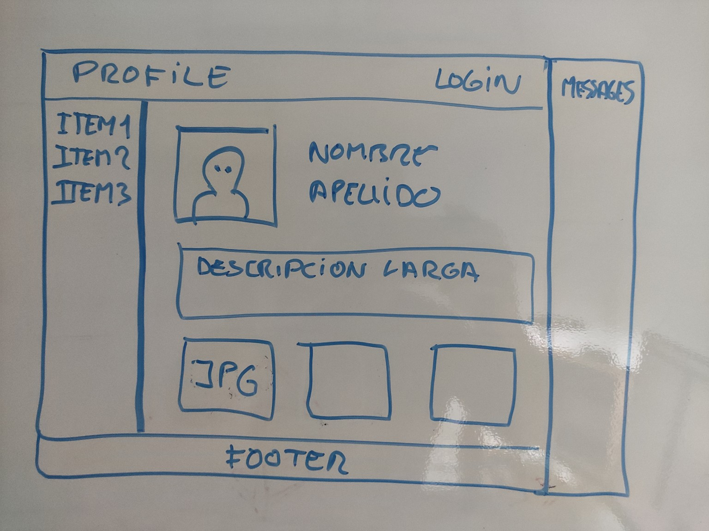
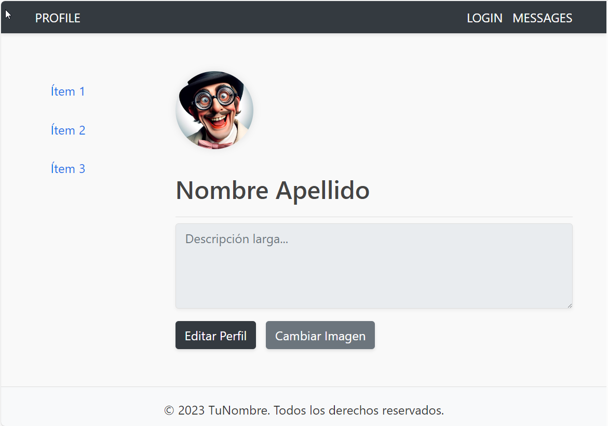

# UI generada por GTP-4V a partir del boceto capturado por cámara

Estás mostrando un boceto de una interfaz de usuario (UI) que parece ser para una página de perfil de un usuario.

## Características que observo:

1. **Encabezado con las opciones "PROFILE", "LOGIN", y "MESSAGES"**: Esto indica que los usuarios pueden acceder a su perfil, iniciar sesión y ver sus mensajes desde esta página.
2. **Sección de ítems en la parte izquierda**: Esta sección tiene tres ítems enumerados, lo que podría representar categorías o características del usuario.
3. **Imagen de perfil**: Hay un espacio reservado para la imagen del perfil del usuario.
4. **Nombre y Apellido**: Esta sección probablemente se refiere al nombre completo del usuario.
5. **Descripción Larga**: Parece ser un espacio donde el usuario puede agregar una descripción o biografía detallada.
6. **Área para imágenes (JPG)**: Hay espacios designados para añadir imágenes, lo que podría ser para fotos adicionales o posiblemente para una galería de fotos del usuario.
7. **Footer**: Un pie de página que podría contener información adicional o enlaces.

## Opiniones y recomendaciones:

- **Claridad**: El diseño es sencillo y directo, lo que podría facilitar la navegación para los usuarios.
- **Espacio para la descripción**: Es bueno que haya un espacio para la "descripción larga", pero asegúrate de que los usuarios sepan el límite de caracteres o palabras.
- **Ítems en la sección izquierda**: Sería útil especificar qué representa cada ítem para entender mejor su función.
- **Botones de acción**: Considera agregar botones de acción como "editar perfil" o "cambiar imagen de perfil" para que los usuarios puedan modificar su información fácilmente.
- **Responsividad**: Asegúrate de que el diseño sea responsivo y se vea bien en dispositivos móviles y de escritorio.

En general, es un buen comienzo. Te sugiero que pruebes el diseño con algunos usuarios para obtener retroalimentación y hacer los ajustes necesarios. ¡Buena suerte!

# UI Generated

